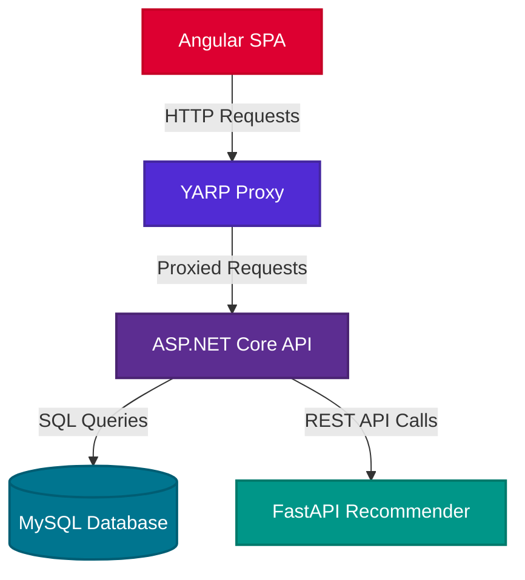

# Anime Rest API

This repository is part of a larger project and contains only the main backend.

- [Client side application](https://github.com/jklzz02/Anime-client)

- [Recommender API](https://github.com/jklzz02/Anime-recommender)
