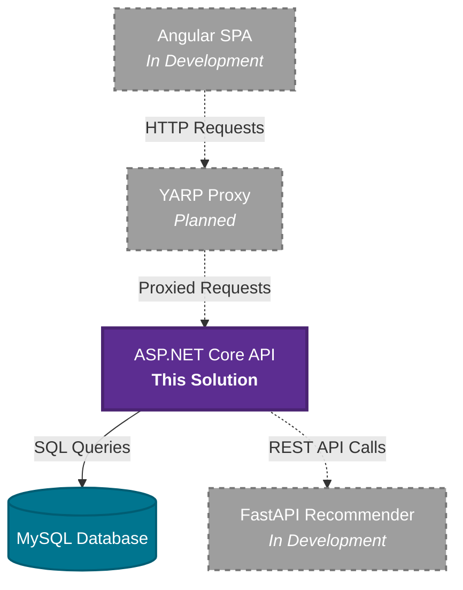
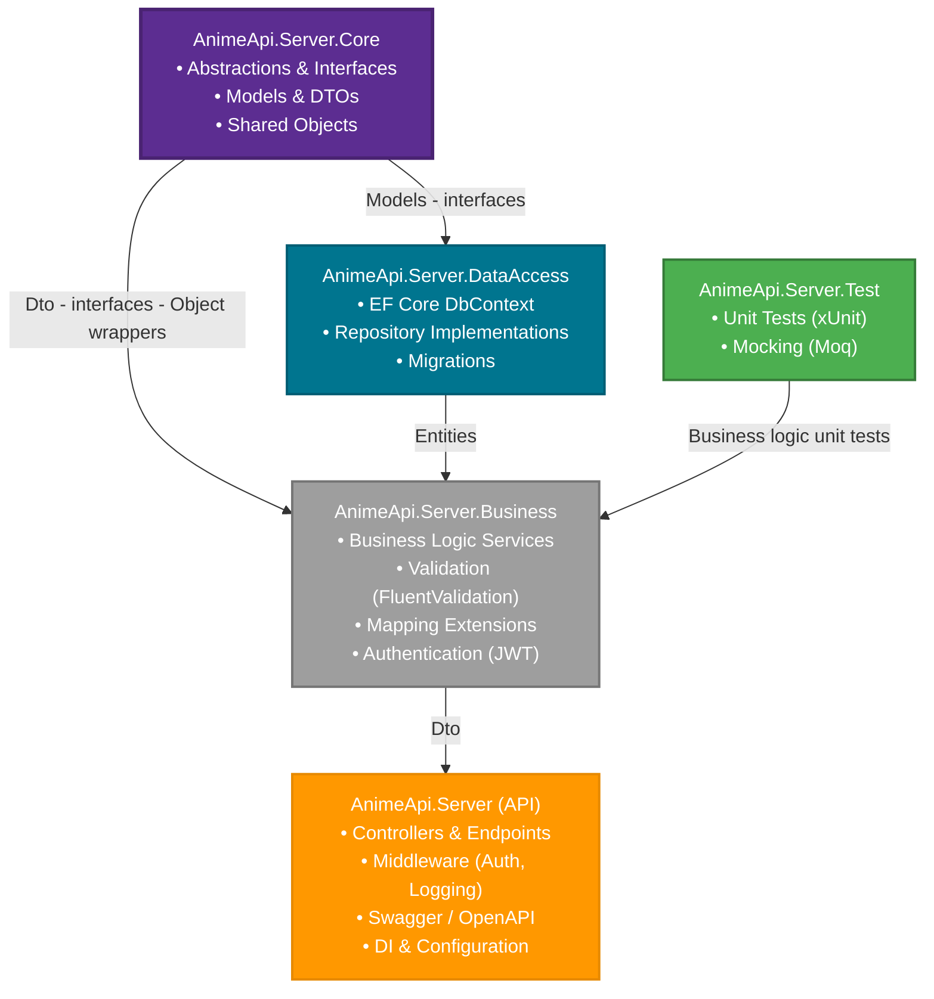

# Anime REST API

ASP.NET Core Web API implementing Clean Architecture principles for anime data management with integrated machine learning recommendations and Single Page Application client.

[](https://dotnet.microsoft.com/)
[](https://dotnet.microsoft.com/apps/aspnet)
[](https://learn.microsoft.com/ef/core/)
[](https://www.mysql.com/)
[](https://docs.fluentvalidation.net/)
[](https://swagger.io/)
[](https://jwt.io/)
[](https://xunit.net/)
[](https://github.com/moq/moq4)

## System Overview



**Current Status**: The Angular frontend, YARP reverse proxy, and FastAPI recommender service are in development. This repository contains the complete, production-ready REST API solution.

## Solution Architecture

This solution follows **Clean Architecture** principles with clear separation of concerns across four projects



### [AnimeApi.Server.Core](./AnimeApi.Server.Core/)

**Purpose**: Defines contracts and shared objects across all layers

- **Interfaces**: Repository abstractions (`IRepository<T>`, domain service contracts)
- **Models**: Domain entities and data models
- **DTOs**: Data transfer objects for API communication
- **Shared Objects**: Search parameters, constants, enumerations
- **Dependencies**: Completely independent from other projects to ensure loose coupling

### [AnimeApi.Server.DataAccess](./AnimeApi.Server.DataAccess/)

**Purpose**: Implements data persistence using Entity Framework Core

- **Repository Implementation**: Concrete implementations of Core interfaces
- **Database Context**: EF Core `DbContext` configuration
- **Dependency Injection**: `ServiceCollectionExtensions.cs` for DI registration
- **Dependencies**: `AnimeApi.Server.Core`

### [AnimeApi.Server.Business](./AnimeApi.Server.Business/)

**Purpose**: Encapsulates business logic and orchestration

- **Business Services**: Domain logic implementation
- **Mapping Extensions**: Entity to DTO transformation methods
- **Validators**: Input validation using FluentValidation
- **Authentication**: JWT token services and identity management
- **Dependency Injection**: Service registration extensions
- **Dependencies**: `AnimeApi.Server.Core` only (no DataAccess reference)

### [AnimeApi.Server](./AnimeApi.Server/)

**Purpose**: Web API layer and application entry point

- **Controllers**: RESTful API endpoints
- **Middleware**: Authentication, logging, exception handling
- **Configuration**: Dependency injection wiring and application setup
- **Swagger**: API documentation and testing interface
- **Dependencies**: All other projects for DI container configuration

### [AnimeApi.Server.Test](./AnimeApi.Server.Test)

**Purpose**: Comprehensive unit testing suite

- **Business Logic Tests**: Validation of business layer functionality
- **Test Framework**: xUnit with Moq for mocking
- **Coverage**: Business layer methods and service implementations

## Clean Architecture Benefits

- **Independence**: Core layer has zero dependencies, enabling flexibility
- **Testability**: Business logic isolated from infrastructure concerns
- **Maintainability**: Clear separation allows independent evolution of layers
- **Dependency Inversion**: Higher-level modules don't depend on lower-level modules

## Technology Stack

| Layer              | Technologies                    |
| ------------------ | ------------------------------- |
| **Web API**        | ASP.NET Core, Swagger/OpenAPI   |
| **Business Logic** | FluentValidation, Google Oauth2 |
| **Data Access**    | Entity Framework Core, MySQL    |
| **Authentication** | JWT Bearer tokens               |
| **Testing**        | xUnit, Moq                      |

## Database Integration

- **Provider**: MySQL with Entity Framework Core (Pomelo)
- **Migrations**: EF migrations
- **Connection Management**: Managed through ASP.NET Core DI

## API Features

- **RESTful Design**: Standard HTTP methods and status codes
- **Authentication**: JWT-based security
- **Validation**: Input validation through FluentValidation
- **Documentation**: Swagger UI
- **Error Handling**: Consistent error response format

## Getting Started

### Prerequisites

- .NET 8.0 SDK
- MySQL Server 8.0+
- IDE (Visual Studio, VS Code, or Rider)

### Setup

```bash
git clone https://github.com/jklzz02/Anime-Rest-API
cd Anime-Rest-API
```

**Restore dependencies & update database:**

```bash
dotnet restore

dotnet ef database update --project AnimeApi.Server.DataAccess --startup-project AnimeApi.Server
```

**Setup secrets & config:**

There's a comprehensive [sample file](./AnimeApi.Server/appsettings.Sample.json) to setup the web project secrets such as

- Google client secret
- Secret key

and also domains for external services and the client, to avoid `cors` issues and to hard code domains.

- Recommender domain
- Client domain

**Run the Web project:**

```bash
dotnet run --project AnimeApi.Server
```

### Testing

```bash
dotnet test AnimeApi.Server.Test

```

- Generators are used to create testing data
- Theories and interface mocks are the preferred approach

## Development Workflow

1. **Domain Changes**: Start with Core project if needed (abstractions)
2. **Data Layer**: Implement repositories in DataAccess project
3. **Business Logic**: Add services or repositories to helpers in Business project
4. **API Endpoints**: Create controllers in Server project
5. **Testing**: Write unit tests in Test project

---
